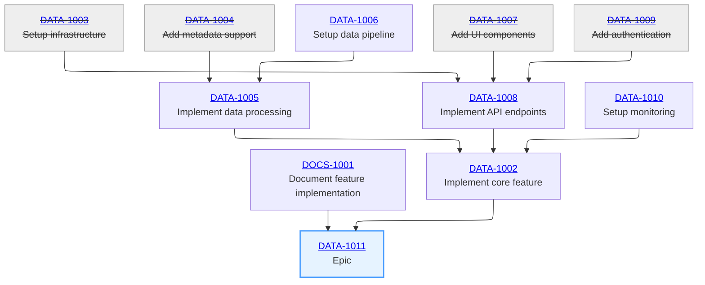

# Jira Epic Dependency Graph Generator

This script generates a [Mermaid](https://mermaid.js.org/) flowchart showing the dependency
relationships between issues in a Jira epic.  It's particularly useful for visualizing the structure
and progress of complex epics.

## Setup

1. Get your Jira API token:
   - Go to https://id.atlassian.com/manage-profile/security/api-tokens
   - Click "Create API token"
   - Give it a name and copy the token value

2. Create a `.env` file in the project directory with your Jira credentials:
```bash
JIRA_EMAIL=your.email@company.com
JIRA_API_TOKEN=your-api-token
JIRA_URL=https://your-company.atlassian.net
```

## Usage

Install dependencies:
```bash
pip install -r requirements.txt
```

Basic usage:
```bash
python graph.py EPIC-KEY
```

Example:
```bash
python graph.py DATA-3377
```

### Command Line Options

- `EPIC-KEY`: The key of the epic to analyze (required)
- `--skip-closed`: Skip rendering closed issues in the graph
- `--blocks-linktype`: The Jira link type to follow (default: "Blocks")
- `--closed-status`: The status name that indicates a closed issue (default: "closed")

Examples:
```bash
# Use a different link type
python graph.py DATA-3377 --blocks-linktype "Relates to"

# Use a different closed status
python graph.py DATA-3377 --closed-status "done"
```

## Output

The script outputs a Mermaid flowchart that can be rendered in:
- GitHub markdown
- Mermaid Live Editor (https://mermaid.live)
- VS Code with Mermaid extension
- Other Mermaid-compatible tools

The flowchart includes:
- All issues in the epic
- Dependencies between issues
- Links to Jira for each issue
- Visual distinction for closed issues
- Connection of leaf nodes to the epic

## Example Output



Tip: You can render the Mermaid output in [mermaid.live](https://mermaid.live/) or as a GitHub Gist:
https://gist.github.com/n0nick/bdf92b57c510fd3eaa498a22dbb2637b